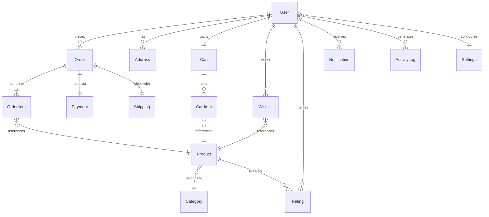
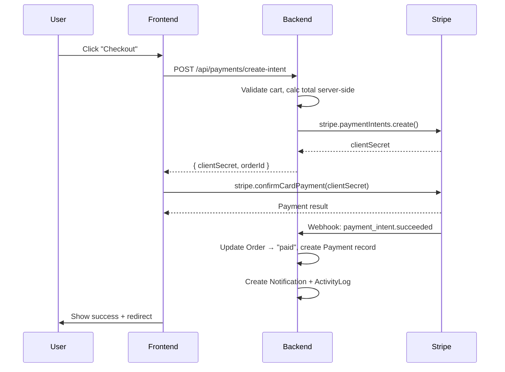

# Maison Élite — Complete Database Schema

All models use Mongoose with `{ timestamps: true }`.

---

## Entity Relationship Diagram



---

## 1. User (Existing — Extend)

> [!NOTE]
> Already exists at [backend/models/User.js](file:///e:/web%20dev/E_store/MAISON-LITE/backend/models/User.js). Add the `role` ref and `phone` field.

| Field | Type | Notes |
| :--- | :--- | :--- |
| `name` | String | ✅ exists |
| `email` | String | ✅ exists, unique |
| `password` | String | ✅ exists, hashed |
| `role` | Enum `user` / `admin` | ✅ exists |
| `avatar` | String | ✅ exists |
| `phone` | String | **NEW** — for shipping |
| `defaultAddress` | Ref(Address) | **NEW** |
| `isVerified` | Boolean | ✅ exists |

---

## 2. Product

| Field | Type | Notes |
| :--- | :--- | :--- |
| `name` | String, required | |
| `slug` | String, unique | Auto-generated from name |
| `description` | String | Long-form for SEO |
| `price` | Number, required | Current selling price |
| `compareAtPrice` | Number | Original / strike-through price |
| `parentCategory` | Ref(Category) | Replaces `category` for Breadcrumb hierarchy |
| `badge` | Enum: `New`, `Sale`, `Bestseller`, `""` | |
| `images` | [String] | Array of URLs |
| `variants` | [Variant] | Array containing `{ color, size, price, stock }` |
| `isActive` | Boolean, default true | Soft-delete / draft |

---

## 3. Category

| Field | Type | Notes |
| :--- | :--- | :--- |
| `name` | String, unique | e.g. "Dresses" |
| `slug` | String, unique | e.g. "dresses" |
| `description` | String | SEO meta |
| `image` | String | Category banner |
| `parent` | Ref(Category) | For sub-categories |

---

## 4. Cart

| Field | Type | Notes |
| :--- | :--- | :--- |
| `user` | Ref(User), unique | One cart per user |
| `items` | [CartItem] | Embedded subdocument |

**CartItem (embedded)**:
| Field | Type |
| :--- | :--- |
| `product` | Ref(Product) |
| `qty` | Number, min 1 |
| `priceSnapshot` | Number |

---

## 5. Wishlist

| Field | Type | Notes |
| :--- | :--- | :--- |
| `user` | Ref(User) | |
| `product` | Ref(Product) | |

> Compound unique index on `{ user, product }`.

---

## 6. Order

| Field | Type | Notes |
| :--- | :--- | :--- |
| `orderId` | String, unique | Display ID `#ME-XXXX` |
| `user` | Ref(User) | |
| `items` | [OrderItem] | Embedded — price snapshot |
| `subtotal` | Number | Before shipping/tax |
| `tax` | Number | |
| `shippingCost` | Number | |
| `totalAmount` | Number | Final charge |
| `status` | Enum | `pending`, `processing`, `paid`, `shipped`, `delivered`, `cancelled` |
| `shippingAddress` | Ref(Address) | |
| `notes` | String | Customer notes |

**OrderItem (embedded)**:
| Field | Type |
| :--- | :--- |
| `product` | Ref(Product) |
| `name` | String |
| `price` | Number |
| `qty` | Number |
| `image` | String |

---

## 7. Payment

| Field | Type | Notes |
| :--- | :--- | :--- |
| `order` | Ref(Order), unique | |
| `user` | Ref(User) | |
| `stripePaymentIntentId` | String, unique | |
| `amount` | Number | In cents |
| `currency` | String, default `usd` | |
| `status` | Enum | `pending`, `succeeded`, `failed`, `refunded` |
| `method` | String | `card`, `apple_pay`, etc. |
| `refundId` | String | Stripe refund ID |
| `refundReason` | String | |

---

## 8. Address

| Field | Type | Notes |
| :--- | :--- | :--- |
| `user` | Ref(User) | |
| `label` | String | "Home", "Office" |
| `fullName` | String | Recipient name |
| `line1` | String, required | |
| `line2` | String | |
| `city` | String, required | |
| `state` | String | |
| `postalCode` | String, required | |
| `country` | String, required | |
| `phone` | String | |
| `isDefault` | Boolean | |

---

## 9. Rating

| Field | Type | Notes |
| :--- | :--- | :--- |
| `user` | Ref(User) | |
| `product` | Ref(Product) | |
| `rating` | Number, 1–5 | |
| `title` | String | |
| `comment` | String | |
| `isVerifiedPurchase` | Boolean | Auto-set if user ordered item |

> Compound unique index on `{ user, product }`.

---

## 10. Settings

| Field | Type | Notes |
| :--- | :--- | :--- |
| `user` | Ref(User), unique | |
| `theme` | Enum: `dark`, `light` | default `dark` |
| `language` | String | default [en](file:///e:/web%20dev/E_store/MAISON-LITE/frontend/src/App.jsx#18-164) |
| `currency` | String | default `USD` |
| `emailNotifications` | Boolean | default true |
| `pushNotifications` | Boolean | default false |
| `twoFactorEnabled` | Boolean | default false |

---

## 11. Shipping

| Field | Type | Notes |
| :--- | :--- | :--- |
| `order` | Ref(Order), unique | |
| `carrier` | String | "FedEx", "DHL", etc. |
| `trackingNumber` | String | |
| `trackingUrl` | String | |
| `status` | Enum | `processing`, `shipped`, `in_transit`, `delivered`, `returned` |
| `estimatedDelivery` | Date | |
| `shippedAt` | Date | |
| `deliveredAt` | Date | |

---

## 12. Notification

| Field | Type | Notes |
| :--- | :--- | :--- |
| `user` | Ref(User) | |
| `type` | Enum | `order_update`, `promo`, `system`, `review_request` |
| `title` | String | |
| `message` | String | |
| `link` | String | Deep-link URL |
| `isRead` | Boolean, default false | |

---

## 13. ActivityLog

| Field | Type | Notes |
| :--- | :--- | :--- |
| `user` | Ref(User) | Nullable for system events |
| `action` | Enum | [login](file:///e:/web%20dev/E_store/MAISON-LITE/frontend/src/context/AuthContext.jsx#37-47), [logout](file:///e:/web%20dev/E_store/MAISON-LITE/frontend/src/services/api.js#53-58), `order_placed`, `password_changed`, `settings_updated`, `admin_action` |
| `resource` | String | e.g. "Order", "Product" |
| `resourceId` | String | The affected document ID |
| `ip` | String | |
| `userAgent` | String | |
| `details` | Mixed | Extra metadata |

> TTL index: auto-delete after 90 days.

---

## 14. SEO Schema (JSON-LD — Frontend)

### Product Page
```json
{
  "@context": "https://schema.org/",
  "@type": "Product",
  "name": "Obsidian Slip Dress",
  "image": "https://...",
  "brand": { "@type": "Brand", "name": "Maison Élite" },
  "offers": {
    "@type": "Offer",
    "priceCurrency": "USD",
    "price": "289.00",
    "availability": "https://schema.org/InStock"
  },
  "aggregateRating": {
    "@type": "AggregateRating",
    "ratingValue": "4.8",
    "reviewCount": "42"
  }
}
```

### Breadcrumb
```json
{
  "@context": "https://schema.org",
  "@type": "BreadcrumbList",
  "itemListElement": [
    { "@type": "ListItem", "position": 1, "name": "Home", "item": "https://maisonelite.com/" },
    { "@type": "ListItem", "position": 2, "name": "Dresses", "item": "https://maisonelite.com/category/dresses" },
    { "@type": "ListItem", "position": 3, "name": "Obsidian Slip Dress" }
  ]
}
```

---

## 15. Payment Flow (Stripe)



---

## 16. Implemented Feature Roadmap

Based on the recent architecture upgrades, the following advanced features are fully integrated into the schema and application loop:

### 1. The Hierarchy Challenge (Breadcrumbs)
- **Problem**: Accurately tracking user paths and mapping hierarchical categories.
- **Implementation**: The `Product` schema now uses `parentCategory` instead of a flat `category` string.
- **Frontend**: The `useLocation()` hook parses the URL to instantly generate functional `.map()` segmented breadcrumb routes on Product pages.

### 2. The Performance Challenge (Pagination)
- **Problem**: Sluggish performance with large datasets and offset drift.
- **Implementation**: `backend/controllers/productController.js` accepts `page` and `limit` queries to execute MongoDB `.skip((page - 1) * limit).limit(limit)`.
- **Frontend Sync**: The `HomePage.jsx` fully relies on `useSearchParams` (e.g., `?page=2&sort=Featured`). React state and URL parameters are 100% synced so filters and pagination survive page refreshes.

### 3. The Complexity Challenge (Variants)
- **Problem**: Managing thousands of combinations of colors, sizes, and their specific SKU stocks.
- **Implementation**: `sizes`, `colors`, and `stock` fields were dropped from the base `Product` schema and merged into a `variants` array. Each object holds specific `{ color, size, price, stock }`.
- **Frontend Logic**: Deep client-side variant processing dynamically evaluates "Out of Stock" button-disabling states directly based on user selection matrices.

### 4. Professional Image Hosting (Cloudinary & Multer)
- **Problem**: Storing large media files natively bloats the database and slows down server response times.
- **Implementation**: Introduced `multer` as a middleware to stream incoming multipart/form-data into a temporary local `uploads` directory. The `productController` then securely uploads this file via the Cloudinary v2 SDK (`cloudinary.uploader.upload`) to the cloud. Upon successful upload, the system immediately deletes the temporary file using `fs.unlinkSync()`.
- **Database Architecture**: The Product schema's `image` field was restructured from a flat string to an object `{ url, publicId }` to handle cloud URLs and facilitate easy future deletions from the Cloudinary container natively using the `publicId`.
- **Frontend Integration**: Enhanced the `api.js` request handler to intuitively detect `FormData` instances. If an image binary is attached, it overrides the default `application/json` boundaries, allowing `ProductFormModal.jsx` to transmit live `File` objects securely over the network.
